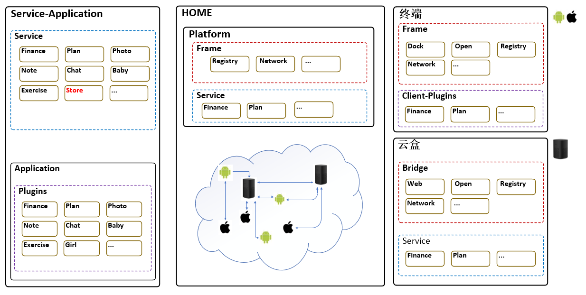

# HOME

HOME是一个专注家庭网络的应用。它设想去中心，可以构建在手机、树莓派、任何Iot设备，它是构建在广域网中的逻辑私有网络应用群。它加密、不可篡改、不上报任何个人数据。

## 为什么我们需要HOME

在回答这个问题前，我想给大家几个问题，我们边问边设想可能的回答

1. 我们用得最多的APP是什么？

> 微信？淘宝？京东？支付宝？微博？腾讯新闻？UC浏览器？....

2. 我们每天用它们多久？

> 也许大于5个小时

3. 它们每天统计多少多们的东西？

> 微信收集我们的聊天信息，淘宝出卖我们的购买记录，京东搜的东西将会出现在UC浏览器的启动广告里...

4. 等等等

我不知道大家担忧上面的问题，我们的吃穿、住行、工作，甚至睡眠，都牢牢被大公司盯着，盯得紧紧的，让人感觉总有双眼睛盯着你。我不怀疑移动支付等新兴科技带来的便利，可是我怀疑的是我们是否需要把我们的数据交给他们？有没有一种可能，数据在我们自己的家庭服务器上，而服务器可以是任何一种设备，它以加密方式存储数据。

网络到底是拉近了我们的距离还是捅破了我们的窗户纸？没有一个大厂没有上报我们的行为数据，**我们都是在大街上裸奔的巨婴，每个巨头呵护着我们的生活**。

所以，我就在想，能不能构建一个网络，它没有中心，只有P2P，聊天、家庭的生活数据都维护在自己的树莓派或其它私有设备上。

也可以说，**HOME**将可能会是一个区块链应用，我不否定这一点。

## 为什么我们不能光依靠法律

法律可以约束企业台面上的行为，可是台面下的动作我们永远无法知晓，一条法律的存在说明它所禁止的违法行为不会停止出现。我们不能只依靠法律，我们需要科技的力量，让这些行为不可能发生，而不是禁止它们发生。

## HOME云

理应存在两种HOME云，私有云、公有云、局域云，同时针对不同需求的用户。私有云面向有能力，期望独立部署的用户；公有云则由平台组建，提供给选择相信平台、选择便利的用户；局域云面向小区用户群体。

### 私有云

不同于云部署，我这里指的家庭私有云是自行部署在家里，通过我们的光纤宽带注册到Network上，可能是Go-micro的Network，也可能是其它的注册中心。但是只是注册一些服务的接口，服务逻辑仍然在我们本地，数据本身自然也是在本地。家庭自身的数据是保密的，其它平台是无法获取的，或者我们也可以辅助备份，加密备份，加密的密钥由主人持有，服务端不做任何存储，加密存储也不会做，目的只是保证数据在平台这一侧是无法解密的，自然也就不存在暴露的风险，暴露了也是乱码。（暴力破解可能性存在，但是这是安全方面的事，不是服务本身的事，暴力破解到的只是一个人的，而平台泄漏，则是全部的）。

试想，我们每个家庭都有自己的服务器，它可能是一台电脑，可能是一台单片机，甚至是我们淘汰下来的手机，这些都可能是我们的私有人中心。它们保护着我们的隐私，我们的自由。

我个人非常反感用户大数据，当我们把数据暴露给大厂平台时，我们的隐私真的能被保证吗？国家法律无法禁止的东西，企业的安全合规真的能行？

## 公有云

公有云除了承担节点的注册发现、类DNS的服务外，还会承担部署HOME应用的职责，为所有节点提供应用服务。

## 局域云

面向小区、公司、家族等聚焦群体的快速响应局域网节点互联云，这些节点不必须注册到中央平台，它们通过GOSSIP或MDNS等广/组播协议通信互传信息。

## 如何对在公网的设备通信

提供中央平台登录，这是公网的地址，登录后获取注册上来的设备地址，跳转到这个地址。此时两个思路为：

1. P2P包通信，设备与盒子直接对接通信。
2. 盒子分发域名，解析到盒子分到的公网IP，现在IPv6已经开始流行，广域设备都有一个IP成为趋势。

## HOME中的服务架构

### 计划

家庭的生活、工作等计划管理

### 财务

家庭收支管理

### 相册

家庭相册

### 记事

快捷家庭记事本

### 孩子

1. 成长记录
2. 成绩
3. .. 

### 聊天

家庭私有小群聊天，可能可以做成P2P的家庭网络交流圈

## 5G

随着5G的到来，速度越来越快，流量越来越便宜，私有移动服务器的可能性越来越大，也就是说，我们的家庭私有云将打破现有的网络格局，不再依赖宽带，延时越来越小，受小区网络影响可能性越来越少。

## 盒子

可能会用一个树莓派作为家庭应用中心，在上面安装我们的服务。

## 家庭设备

作为家庭设备的中心，可以参考米家那样的布局，不同的是，他们的数据是存在云端的，也是要上报的，我们的盒子不用。

## 代码目录

### [chat](./chat) 聊天

### [gateway](./gateway) 家庭轻量网关

### [common](./common) 公用包

### [doc](./doc) 文档目录

### [finance](./finance) 账务管理

#### [book](./finance/book) 账本

- 支出
- 收入
- 标签，自定义标签

### [note](./note) 记事本

### [open](./open) 开放平台，用于家庭私有云选择性开发部分能力，比如与其它家庭建立聊天群，共享计划等等

### [photo](./photo) 照片

### [plan](./plan) 家庭工作、生活、旅行等计划管理

### [platform](./platform) 核心平台，家庭网络中央服务节点平台，公有云部署

### [proto](./proto) 接口原型文件

### [web](./web) 私有云桌面端浏览器入口
